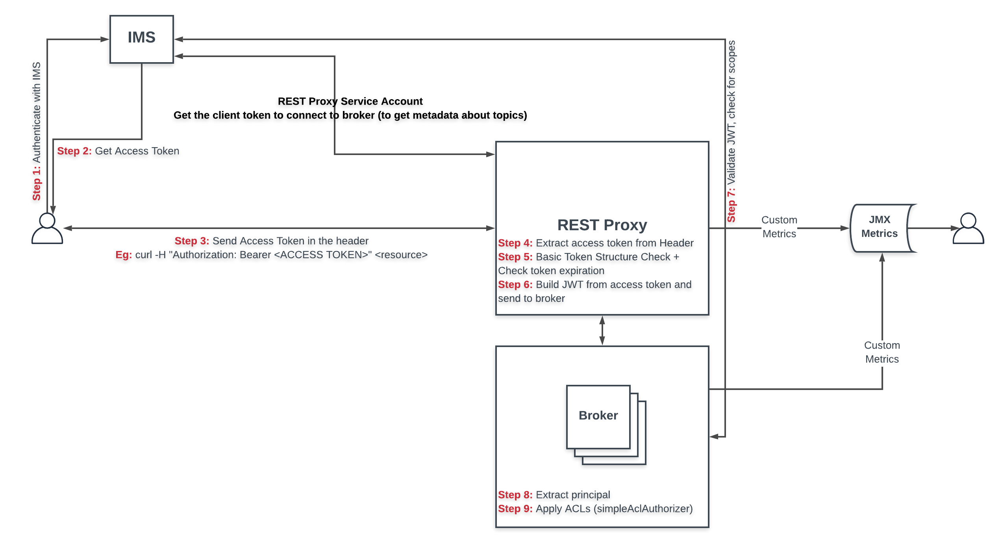

# kafka-ims plugins

These are the plugins for use on Confluent's Rest Proxy. The principal purpose of these plugins is to use IMS to Authenticate a valid  user and then Authorize the user to perform topic level operations using `SimpleAclAuthorizer` plugin. For Java clients, this works by passing valid JAAS configurations. REST clients are expected to pass the IMS token using Authorization header in the HTTP calls.

## Architecture



## Modules

- kafka-ims-common: Common functions to be used at another modules
- kafka-ims-java: AuthenticateCallbackHandler implementations used at Kafka broker and by Java Clients to handle IMS Authentication using OAUTHBEREAR implementation of SASL.
- kafka-ims-rest: RestResourceExtension and AuthenticateCallbackHandler implementations that handle the Bearer token sent on HTTP call. REST Proxy then connects to secure broker using OAUTHBEREAR implementation of SASL.
- kafka-ims-sample: Sample Producer/Consumer Java Clients using the above plugins.
- docker: Build a Containerized Development Environment to test the plugins.

## Building the jar files

### Requirements

- JDK 8 or above
- Maven 3.6 or above

### How to Build all modules

With all requirements installed, we just need to run the command ```mvn -e clean package``` on the project root folder **kafka-ims** to generate all modules jar files. The jar files will be on each module folder on the target directory.

### How to Build a single module

With all requirements installed, we just need to run the command ```mvn -e -pl <module-name> -am clean package``` on the project root folder **kafka-ims** to generate artifacts for that module. The jar files will be generated in the **target** directory of the module.

Example: To build only the kafka-ims-java module and his dependencies we will be run the command ```mvn -e -pl kafka-ims-java -am clean package```

## Building the package
The package is built in docker using modern features.  

Ensure that docker is installed on your system:

### Ubuntu
Follow these instructions if you want to install docker using native Ubuntu mechanisms.

1. Follow the instructions at https://docs.docker.com/install/linux/docker-ce/ubuntu/.
2. Ensure that docker is running:
   ```bash
   systemctl start docker
   ```
3. If you want to run containers as your own account (rather than root), add your account to the "docker" group
and ensure you log out and back in.

### Using Homebrew/Linuxbrew
Follow these instructions if you want to install docker using homebrew.

```bash
# once
brew install make docker
# once for MacOS
brew cask install docker-edge
```

### Login to docker.io (once - after first install of docker)
This is required the first time you need to build something with docker.
```bash
docker login --username <docker.io username>
```

### Build the package
```bash
make rpm
```

## Deploy the distribution
Use your [API Key](https://wiki.corp.adobe.com/display/Artifactory/API+Keys) to deploy to Artifactory.  Prior
to doing this, you must have the jfrog CLI installed somewhere in your PATH.

### Using Homebrew/Linuxbrew
This example uses [Homebrew](https://brew.sh) or [Linuxbrew](https://linuxbrew.sh) to install the jfrog CLI.

```bash
brew install jfrog-cli-go
```

### Using Other OS
Download the jfrog CLI from https://jfrog.com/getcli/ and put it somewhere in your PATH

### Preparing jfrog CLI
After install, provider your user and API key to the CLI for future use.

```bash
jfrog rt c corp --url=https://artifactory.corp.adobe.com/artifactory --user=$USER --access-token=$API_KEY
```

### Deploying to Artifactory
```bash
make deploy
```
